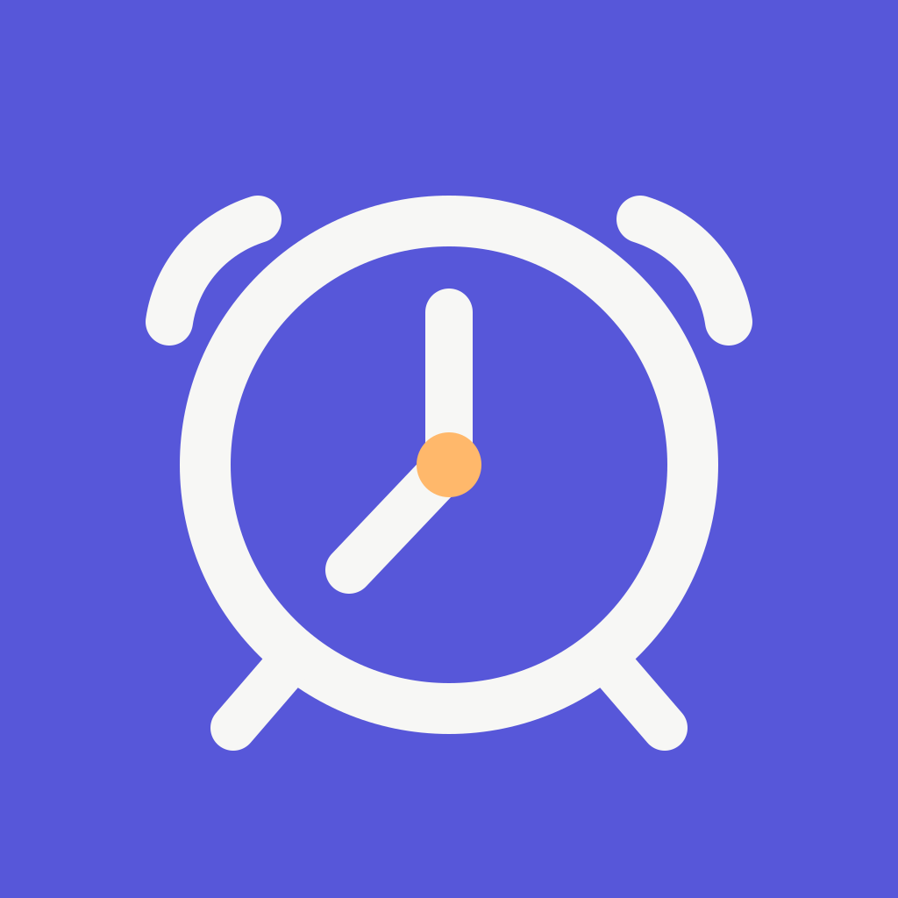
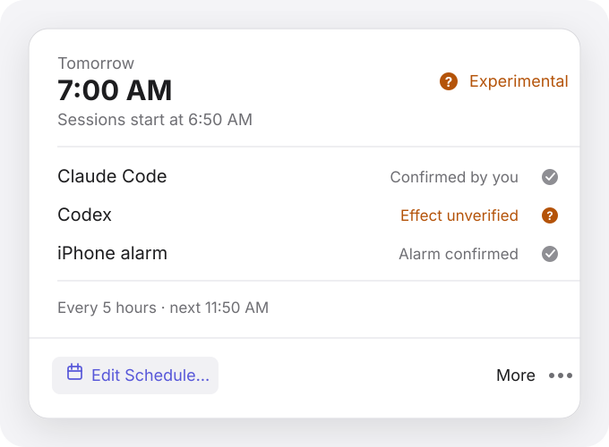

<p align="center">
  
</p>

<h1 align="center">Wakebar</h1>

<p align="center">
  Schedule a Claude Code wake-up and test an experimental Codex proxy before you wake up.<br>
  After provider setup, the Mac can stay off. The optional alarm also needs iPhone confirmation.
</p>

<p align="center">
  <strong>Native SwiftUI</strong> · macOS 14+ · iOS 26+
</p>

<p align="center">
  <a href="Docs/Images/wakebar-overview.svg">
    
  </a>
</p>

<p align="center"><sub>Example with confirmed Claude setup and the experimental Codex route enabled. Open the image for a full-size view.</sub></p>

Wakebar turns one wake time into provider-hosted prompts and an optional iPhone alarm. For Claude, Wakebar opens Claude Code’s official Routine setup and asks it to update only schedule-specific Wakebar Routines. You verify Claude’s proposed names, times, and links before confirming that setup is complete. ChatGPT task creation remains a guided manual step. The default Claude Routine asks for `yes`; the experimental ChatGPT task sends `hi`. OpenAI has not documented whether this changes Codex usage limits. The iPhone companion receives the alarm schedule through iCloud and registers it with AlarmKit.

> [!IMPORTANT]
> The macOS tests, iOS Simulator tests, and unsigned Release builds pass. Signed CloudKit, push-notification, and AlarmKit behavior still needs acceptance testing on a physical iPhone.

## How it works

<p align="center">
  <a href="Docs/Images/wakebar-flow.svg">
    
  </a>
</p>

Wakebar starts Claude Code’s supported `/schedule` workflow and supplies the names, prompts, times, time zone, and safety limits. Wakebar asks Claude to show a combined review before it changes the Routines. Because this workflow is conversational, you must verify Claude’s proposal and the resulting Routine links. For Codex, Wakebar still prepares a ChatGPT scheduled task for you to create and confirm.

| At the scheduled time | One-time setup | Works with the Mac off |
| --- | --- | :---: |
| Start Claude Code | Let Wakebar open Claude Code, verify its Routine proposal and links, and confirm setup | Yes |
| Test the Codex wake-up proxy | Create the generated ChatGPT scheduled task and confirm its times | Task: Yes; Codex effect: Unverified |
| Ring the wake alarm | Let the iPhone receive the schedule and confirm AlarmKit | After iPhone confirmation |
| Refresh sessions every five hours | Ask Claude to update its Wakebar Routines and create the experimental ChatGPT task | Yes |

Wakebar reports each stage separately. A schedule is not a sent prompt. A sent prompt is not proof that a provider reset a usage window.

## Included

- A compact macOS menu-bar schedule editor and status view.
- A native iPhone companion for AlarmKit authorization and alarm confirmation.
- Shared schedule compilation for wake, alarm, and five-hour refresh events.
- Versioned local persistence and duplicate-execution protection.
- Conditional CloudKit writes, offline recovery, and phone acknowledgements.
- Provider previews that do not send prompts, plus fixed minimal prompts for hosted tasks.
- Claude Code version and subscription-sign-in checks with an official `/schedule` setup handoff.
- Wakebar does not request or upload consumer subscription credentials.

## Verification

| Check | Result |
| --- | --- |
| Shared XCTest suite on macOS | 78 passed |
| Shared XCTest suite on iOS Simulator | 78 passed |
| iPhone first-launch UI test | Passed |
| macOS and iPhone Release builds | Passed |
| Signed physical-iPhone acceptance | Pending |

The latest [GitHub Actions workflow](https://github.com/24GUNV/wakebar/actions/workflows/ci.yml) uses Xcode 26.6. Simulator tests cannot certify real background CloudKit delivery or system alarm presentation.

## Build

You need:

- macOS 14 or later;
- Xcode 26 or later;
- an Apple development team with access to `iCloud.com.24gunv.wakebar`.

Generate the Xcode project and run the test suite:

```sh
brew install xcodegen
xcodegen generate
xcodebuild \
  -project Wakebar.xcodeproj \
  -scheme Wakebar \
  -destination 'platform=macOS' \
  CODE_SIGNING_ALLOWED=NO \
  test
```

Build and open the signed debug app:

```sh
WAKEBAR_DEVELOPMENT_TEAM=YOUR_TEAM_ID ./Scripts/compile_and_run.sh
```

Create a signed macOS archive:

```sh
WAKEBAR_DEVELOPMENT_TEAM=YOUR_TEAM_ID ./Scripts/package_app.sh release
```

Before distribution, complete the [physical-device release checklist](Docs/RELEASE_CHECKLIST.md).

## Project map

```text
Sources/WakebarCore   Scheduling, providers, persistence, and alarm coordination
Sources/WakebarApp    macOS menu-bar app
Sources/WakebarPhone  iPhone companion
Tests/WakebarTests    Shared deterministic tests
UITests               iPhone launch coverage
Docs                  Integration boundaries and release checks
```

## Design and safety decisions

- Confirmed provider tasks run on provider-hosted infrastructure, so the Mac can be off.
- Consumer subscription credentials stay with their provider.
- The **Preview** control does not send a provider prompt.
- Wakebar records occurrence identifiers before execution to suppress duplicates.
- Before Wakebar removes a service, you confirm that you paused or deleted its hosted task.
- The UI distinguishes scheduled, sent, accepted, and confirmed states.
- Wakebar does not claim that a minimal prompt resets a five-hour or weekly limit.

Read the [integration notes](Docs/INTEGRATIONS.md) and [iPhone reliability model](Docs/IPHONE_COMPANION.md) for the exact capability boundaries.

## Acknowledgements

The menu-bar structure takes inspiration from the MIT-licensed [CodexBar](https://github.com/steipete/CodexBar). See [REFERENCES.md](REFERENCES.md) for attribution details.
