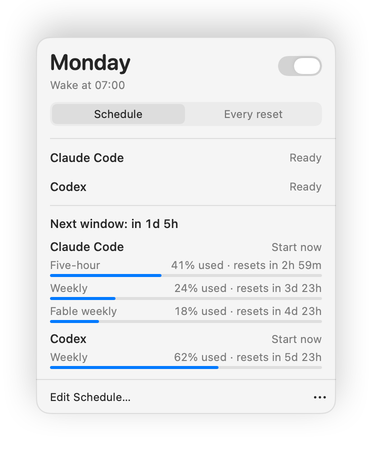
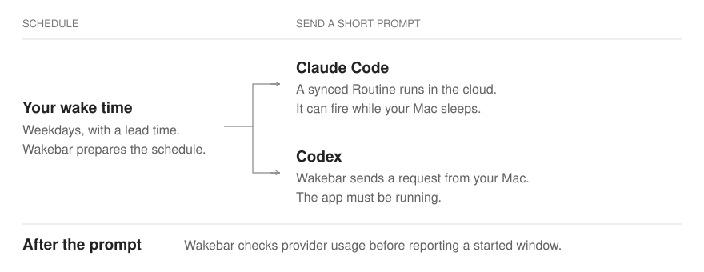

# Wakebar

Wakebar is a small macOS menu-bar app for people who use Claude Code and Codex on a subscription.

Both providers meter you in windows. Claude has a five-hour window and a weekly one. Codex has a weekly one, and a five-hour one on some plans. A window only starts counting when you send your first prompt. Start work at nine, hit the five-hour limit at two, and you wait until seven.

Wakebar sends a one-word prompt a few minutes before you get up. Your first window is already running when you open the laptop, so it resets earlier in the day. That is the whole idea.

<picture>
  <source media="(prefers-color-scheme: dark)" srcset="Docs/Images/wakebar-menu-dark.png">
  
</picture>

## How it works



Tell Wakebar when you wake up and on which days. A few minutes before that, at a lead you choose, it asks each provider for a one-word reply.

- **Claude Code** gets a cloud Routine. Wakebar creates and updates it through the same API Claude Code uses, so it fires even when your Mac is asleep or off. Wakebar only writes the Routines it owns, and only when something changed.

- **Codex** gets one tiny request sent from your Mac, signed with the Codex CLI login you already have and using the model from your Codex config. It only goes out while Wakebar is running. If the Mac was asleep at the time, Wakebar sends it when the Mac wakes, as long as the window has not started yet.

Afterwards Wakebar reads usage from both providers and says **Window started** only when the numbers actually moved. It never assumes a prompt landed.

There is also an **Every reset** mode. Instead of one fixed morning time, Wakebar reopens each window as soon as the previous one resets, so the windows chain back to back through the day. Claude chains off its five-hour window. Codex chains off whatever it reports: a five-hour window on plans that have one, otherwise a single wake after the weekly reset.

The menu shows Claude's five-hour, weekly, and Fable weekly usage, and Codex's weekly usage. Wakebar does not invent a five-hour Codex bar on plans that do not report one.

## What a wake costs

Each wake is one short prompt on your subscription. It does not use Anthropic or OpenAI API credits.

- The Claude Routine is told: `Reply only with hi. Do not use tools, edit files, publish artifacts, or request permissions.`

- The Codex request says `hi` with the instruction `Reply only with hi. Do not use tools.`, no tools, and low reasoning effort. In a live test on September 5, 2026 that cost about five input tokens.

## Requirements

- macOS 14 or later

- Xcode with Swift 6.2 or later

- [XcodeGen](https://github.com/yonaskolb/XcodeGen)

- Claude Code signed in with Claude.ai (for the Claude wake)

- Codex CLI signed in with ChatGPT (for the Codex wake)

Wakebar is a direct-download, notarized app. It is not sandboxed, because it has to read the credentials that Claude Code and Codex CLI already keep on your Mac.

## Install

There is no packaged release yet, so for now follow **Build from source** below. Once the first release lands on [GitHub Releases](https://github.com/24GUNV/wakebar/releases):

1. Download the latest notarized `.dmg` from [GitHub Releases](https://github.com/24GUNV/wakebar/releases).

2. Open the disk image and drag Wakebar to Applications.

3. Open Wakebar from Applications.

Gatekeeper checks the Developer ID signature and notarization ticket. If that check fails, do not bypass it. Delete the download and fetch a fresh copy.

## Build from source

```sh
brew install xcodegen
xcodegen generate
xcodebuild \
  -project Wakebar.xcodeproj \
  -scheme Wakebar \
  -configuration Debug \
  -destination 'platform=macOS' \
  CODE_SIGNING_ALLOWED=NO \
  build
```

The live provider test is opt-in because it fires a real Claude Routine and consumes subscription usage:

```sh
WAKEBAR_LIVE_PROVIDER_TESTS=1 \
WAKEBAR_LIVE_SCHEDULE_FILE=/path/to/disposable-schedule.json \
DEVELOPER_DIR=/Applications/Xcode.app/Contents/Developer \
swift test --disable-sandbox --filter LiveProviderAcceptanceTests
```

For a signed local development build, create the local signing identity once,
then build and run:

```sh
Scripts/setup_dev_signing.sh   # once; creates the "Wakebar Dev Signing" identity
Scripts/compile_and_run.sh
```

Wakebar reads the Claude Code credential through the `security` command,
which macOS lets read the item without a consent dialog, so a normal run
never asks for Keychain access. Debug builds still sign with that fixed
identity so that, if the command fails and the app falls back to the
Security framework, a macOS Keychain "Always Allow" grant survives rebuilds.
An ad-hoc or unsigned build changes identity on every rebuild and macOS asks
again each time. To sign with an Apple team identity instead, set
`WAKEBAR_DEVELOPMENT_TEAM`.

## Set up Wakebar

1. Click the menu-bar icon.

2. Pick your wake time and the days it applies.

3. Choose Claude Code, Codex, or both, and save.

4. Claude setup syncs the Routines for you. Codex setup should show **Codex CLI** as signed in. If it says **Run `codex login`**, do that and reopen the menu.

That is it. The menu shows **Ready** next to each provider once it is wired up.

## Usage and Start now

Opening the menu refreshes usage right away, and every 60 seconds while it stays open. If a provider is signed out, its row tells you the command that fixes it.

**Start now** sends a wake immediately. For Claude it runs the managed Morning Routine, syncing it first if needed. For Codex it sends the request from this Mac. Wakebar then polls usage every 30 seconds for up to five minutes and shows **Window started** once the provider confirms a new five-hour window, or **Week started** when Codex only reports a weekly limit and that limit pins to the request.

## Keeping Claude's Routines in sync

Claude's cron expressions are in UTC, so Wakebar re-syncs at launch, once a day, and whenever the Claude access token changes. That keeps daylight-saving changes from drifting your wake time.

A sync owns every Routine whose name starts with `Wakebar ·`. If you replace a schedule, the old one's Routines are deleted rather than left firing beside the new ones.

In **Every reset** mode, Wakebar keeps one extra `Next reset` Routine pinned to a minute after the current five-hour window resets. It reads Claude usage every five minutes in the background and moves that Routine when the reset moves. Because the Routine fires in the cloud, the Mac does not need to be awake.

One caveat: Anthropic does not document the Routines API. Everything that touches it lives in `ClaudeRoutinesClient`, so if it changes, the rest of the app should not.

## What Wakebar touches

Wakebar reads two credentials that already exist on your Mac: the Claude Code OAuth token in the Keychain, and the Codex CLI login in `~/.codex`. The Claude token goes only to `api.anthropic.com`, and the Codex token only to `chatgpt.com`. Nothing is uploaded anywhere else, and no secret is written to preferences or to this repository.

## Verification

The checks CI runs, for running locally:

```sh
xcodegen generate
find Sources Tests -name '*.swift' -print0 | xargs -0 -n 1 swiftc -frontend -parse
DEVELOPER_DIR=/Applications/Xcode.app/Contents/Developer \
  CLANG_MODULE_CACHE_PATH=/tmp/wakebar-clang-cache \
  SWIFTPM_MODULECACHE_OVERRIDE=/tmp/wakebar-clang-cache \
  swift test --disable-sandbox --scratch-path /tmp/wakebar-swift-test
xcodebuild \
  -project Wakebar.xcodeproj \
  -scheme Wakebar \
  -configuration Release \
  -destination 'generic/platform=macOS' \
  CODE_SIGNING_ALLOWED=NO \
  build
```

## Repository structure

```text
Sources/WakebarCore      Scheduling, provider plans, persistence, and usage models
Sources/WakebarApp       macOS app, provider clients, shared state, and SwiftUI views
Tests/WakebarTests       Deterministic core tests
Tests/WakebarAppTests    Deterministic client, reconciliation, and UI-layout tests
Scripts                  Local build and packaging scripts
Docs                     Integration and release notes
```

See [integration details](Docs/INTEGRATIONS.md) and the [release checklist](Docs/RELEASE_CHECKLIST.md).

The packaging script produces `Wakebar.dmg` and `Wakebar.dmg.sha256` once signing and notarization succeed.
